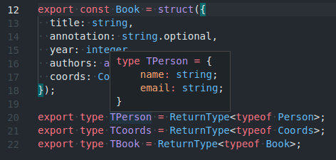
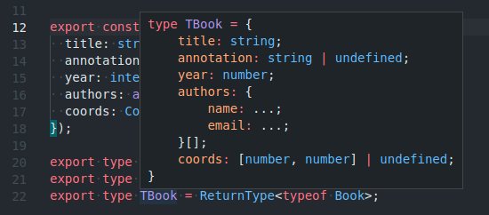

# ts-cast &middot; [](https://coveralls.io/github/DScheglov/ts-cast?branch=master&service=github) [](https://www.npmjs.com/package/ts-cast) [](https://www.npmjs.com/package/ts-cast) [](https://github.com/DScheglov/ts-cast/blob/master/LICENSE)

Runtime type checking for Typescript and JavaScript projects

## Installation

```shell
npm i ts-cast
```

## Overview

The package **ts-cast** is a type checking utility for contract programming.

It allows to describe data schema of the incoming resources (requests to the
application or responses from other applications) and then validate correspondent
resources with the schema.

Let's start with an example:

**./src/schema.ts**

```typescript
import { integer, number, string, struct, tuple, array, toBe } from 'ts-cast';
import v from 'validator';

export const Person = struct({
  name: string,
  email: string.restrict(toBe(v.isEmail, "a valid email")),
});

export const Coords = tuple(number, number);

export const Book = struct({
  title: string,
  annotation: string.optional,
  year: integer,
  authors: array(Person),
  coords: Coords.optional,
});

export type TPerson = ReturnType<typeof Person>;
export type TCoords = ReturnType<typeof Coords>;
export type TBook = ReturnType<typeof Book>;
```

So let's see how `TPerson`, `TCoords` and `TBook` look like:

**TPerson**:



**TCoords**:


**TBook**:



Then we can use defined types and their `caster`-s in this way:

**./src/index.ts**

```typescript
import { Person, TPerson, Book, TBook } from './schema';

const me = Person({ name: "John Smith", email: "john@smith.com" });

const meAgain: TPerson = {
  name: "John Smith",
  email: "john.smith@gmail.com", // but email will not be validated with validator.isEmail
};

const myBook = Book({
  title: "My First Book",
  year: 2021,
  authors: [
    me,
    meAgain,
    { name: 'Some Other Guy', email: 'other.guy@gmail.com' },
  ],
  coords: [1.2, 23.32]
}, "myBook");

const book: TBook = myBook;

console.dir(book, { depth: null });
```
